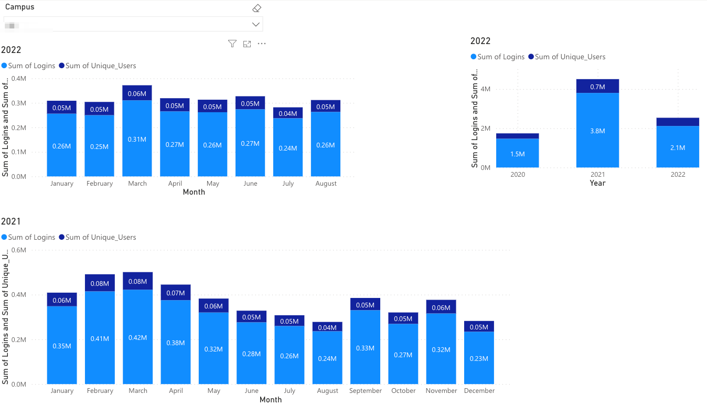
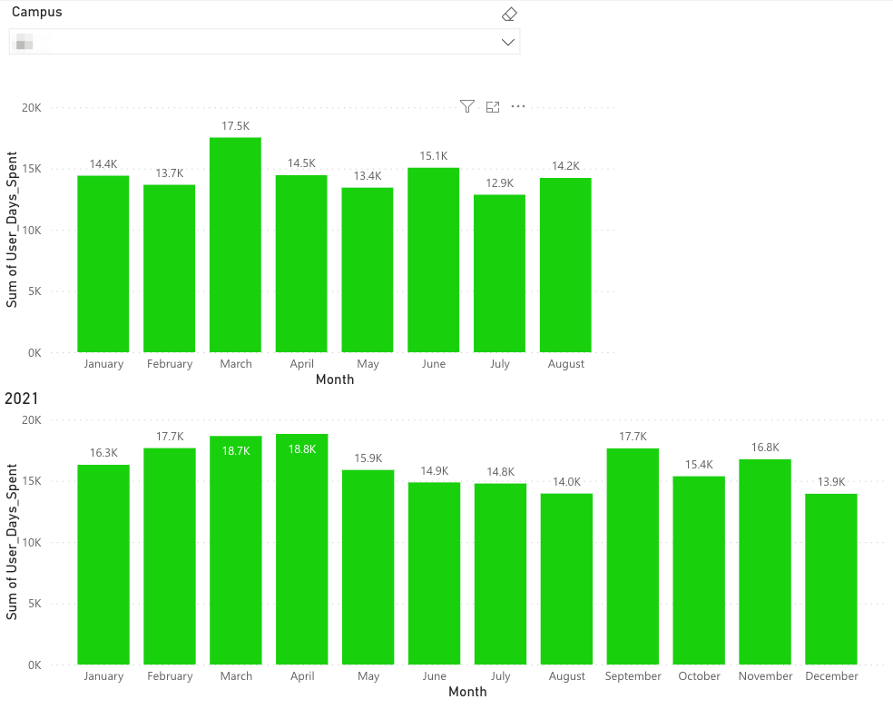
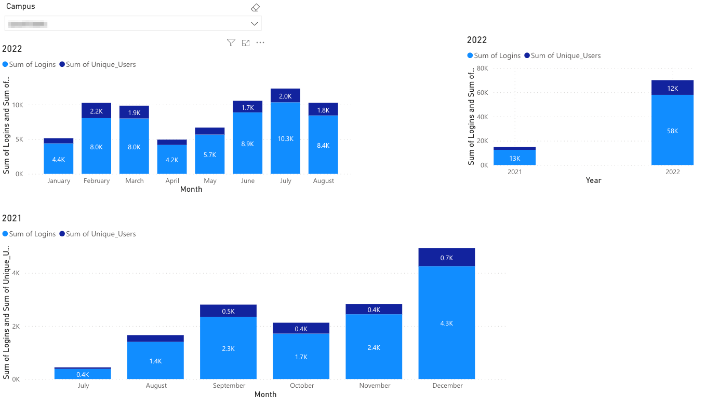
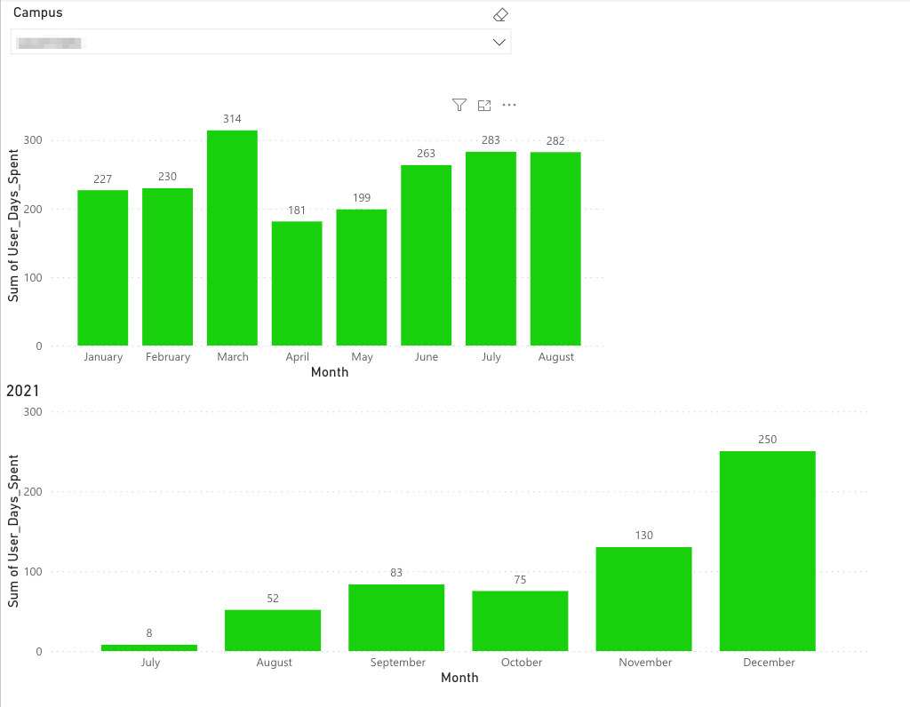

# Customer-Activity-Dashboard
Using Splunk data and Power BI to visualize software platform customer use trends

## Overview and Problem
The team needed some visualizations to analyze customer usage trends. The goal was to visualize patterns over time in order to predict and prevent churn with struggling customers while also promoting expansion for thriving customers. This effort would require collaboration among data engineering, buisiness intelligence, and leadership stakeholders. 

## Insight Examples
### Example 1
In the first example, Figure 1 displays a customer's usage trends in the form of total logins as well as unique logins. From the chart it apears that usage was higher in 2021 than 2022 but more variable. 2021 Peak usage occured in February and March but then declined into the summer with another more subtle peak immerging in the fall months. 

Figure 1. Platform Logins and Unique Logins 2022 vs 2021 for a Customer

The next visualization (Figure 2) shows the time users spent in the platform aggregated into units of days. We use this metric to investigate time spent in the platform to compliment the number of logins to monitor engagement through another lens. For example, users may log in many times but for short periods while others may log in less frequently but for longer periods. In both cases engagement is present but for potentially different use cases. Figure two displays the month over month and year over year data as the customer in Figure 1. It appears that while number of logins decreased month over month from 2021 to 2022 the amount of user time was pretty similar. This may have occured if expansion efforts in 2021 led to lots of logins but adoption efforts in 2022 were focused on getting users to spend more time in the platform. These insights helped account managers talk to customers about the nuances of their strategies allowing our team to better help expand or retain the accounts. 

Figure 2. Time Users Spent Logged into Platform Month over month 2021 vs 2022

### Example 2
In this example, Figure 3 shows the log in trends month over month for 2021 vs the months through August of 2022. This customer came on in July of 2021 so there is nothing to report prior to then. It appears that there was steady growth most months of July and continuing through early 2022. A drop in logins is noted for April, which would have triggered outreach efforts for the customer success team. Log in traffic then steadily increased through July with a slight dip in August. After engaging the customer it was discovered that late spring and late summer were typical vacation months for users which explained the downturns. That said, the year over year totals showed another lens for growth as 2022 totalled more than 4x the number of logins as 2021. 

Figure 3. Custmer Login Trends Example 2

Figure 4. Customer Login time Example 2

## Summary
This quick insight dashboard was created to display customer usage trends month over month and year over year. It includes a dropdown option to look at all customers in aggregate or to filter by a single customer. This dashboard was created to present insights to senior executives as well as provide a tool for account managers to easily monitor the adoption patterns among their customers. This ability has allowed account managers to identify those customer evangalists who may need more support building platform adoption in their oganizations.
